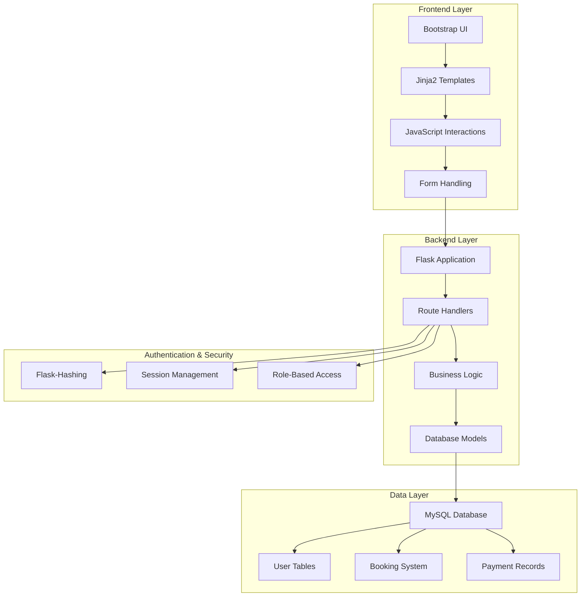

<div align="center"><a name="readme-top"></a>

[](#)

# 🏊‍♂️ Swimming Club Management System (SCMS)<br/><h3>Complete Digital Solution for Community Swimming Clubs</h3>

A comprehensive web-based management system that streamlines operations for community swimming clubs.<br/>
Supports membership management, class bookings, instructor scheduling, facility management, payments, and reporting.<br/>
One-click **FREE** deployment of your swimming club management solution.

[Official Demo][demo-link] · [Documentation][docs] · [Issues][github-issues-link]

<br/>

[][demo-link]

<br/>

<!-- SHIELD GROUP -->

[![][github-release-shield]][github-release-link]
[![][github-license-shield]][github-license-link]
[![][github-forks-shield]][github-forks-link]
[![][github-stars-shield]][github-stars-link]
[![][github-issues-shield]][github-issues-link]<br/>
[![][python-shield]][python-link]
[![][flask-shield]][flask-link]
[![][mysql-shield]][mysql-link]
[![][bootstrap-shield]][bootstrap-link]

**Share Swimming Club Management System**

[![][share-x-shield]][share-x-link]
[![][share-linkedin-shield]][share-linkedin-link]
[![][share-reddit-shield]][share-reddit-link]

<sup>🌟 Revolutionizing swimming club operations. Built for modern community management.</sup>

## 📸 Project Screenshots

> [!TIP]
> Experience the intuitive interface designed for swimming club operations.

<div align="center">
  
  <p><em>Main Dashboard - Comprehensive overview of club activities</em></p>
</div>

<div align="center">
  
  
  <p><em>Advanced Timetable Management and Member Portal</em></p>
</div>

<details>
<summary><kbd>📱 More Screenshots</kbd></summary>

<div align="center">
  
  <p><em>Modern Swimming Facilities Management</em></p>
</div>

<div align="center">
  
  <p><em>Dynamic Class Scheduling and Management</em></p>
</div>

</details>

**Tech Stack Badges:**

<div align="center">

 
 
 
 
 
 
 

</div>

</div>

> [!IMPORTANT]
> This project demonstrates modern full-stack development practices for swimming club management. It combines Python Flask backend with MySQL database and responsive frontend to provide comprehensive club operations management. Features include multi-role authentication, dynamic scheduling, payment processing, and advanced reporting.

<details>
<summary><kbd>📑 Table of Contents</kbd></summary>

#### TOC

- [🏊‍♂️ Swimming Club Management System (SCMS)](#️-swimming-club-management-system-scms)
      - [TOC](#toc)
  - [🌟 Introduction](#-introduction)
  - [✨ Key Features](#-key-features)
    - [`1` Multi-Role Management System](#1-multi-role-management-system)
    - [`2` Advanced Booking & Scheduling](#2-advanced-booking--scheduling)
    - [`*` Additional Features](#-additional-features)
  - [🛠️ Tech Stack](#️-tech-stack)
  - [🏗️ Architecture](#️-architecture)
    - [System Architecture](#system-architecture)
    - [Database Schema](#database-schema)
    - [User Role Structure](#user-role-structure)
  - [🚀 Getting Started](#-getting-started)
    - [Prerequisites](#prerequisites)
    - [Quick Installation](#quick-installation)
    - [Database Setup](#database-setup)
    - [Configuration](#configuration)
  - [📖 Usage Guide](#-usage-guide)
    - [For Members](#for-members)
    - [For Instructors](#for-instructors)
    - [For Managers](#for-managers)
    - [Default Login Credentials](#default-login-credentials)
  - [🔌 Core Modules](#-core-modules)
  - [⌨️ Development](#️-development)
    - [Local Development](#local-development)
    - [Adding Features](#adding-features)
    - [Database Management](#database-management)
  - [🤝 Contributing](#-contributing)
  - [📄 License](#-license)
  - [👥 Team](#-team)

####

<br/>

</details>

## 🌟 Introduction

We are passionate developers creating next-generation swimming club management solutions. By adopting modern development practices and robust technologies, we provide swimming clubs with powerful, scalable, and user-friendly management tools.

Whether you're managing a small community pool or a large aquatic center, this system will streamline your operations. The project is actively maintained and we welcome feedback for any [issues][github-issues-link] encountered.

> [!NOTE]
> - Python 3.8+ required
> - MySQL 8.3.0+ required for data storage
> - Modern web browser for optimal experience
> - Optional: Virtual environment recommended

> [!TIP]
> **⭐ Star us** to receive all release notifications from GitHub without delay!

<details>
  <summary><kbd>⭐ Star History</kbd></summary>
  <picture>
    <source media="(prefers-color-scheme: dark)" srcset="https://api.star-history.com/svg?repos=ChanMeng666%2Fcountryside-community-swimming-club&theme=dark&type=Date">
    
  </picture>
</details>

## ✨ Key Features

### `1` Multi-Role Management System

Experience comprehensive role-based access control designed specifically for swimming clubs. Our innovative approach provides unprecedented flexibility through advanced user management and permission systems.

**Role Capabilities:**

**👥 Members:**
- Self-service membership registration and renewal
- Class and lesson booking capabilities 
- Personal dashboard with booking history
- Profile management with health information
- Customizable membership plans (Monthly/Annual)
- Online payment processing

**🏅 Instructors:**
- Personal schedule management 
- Class attendance tracking
- Student progress monitoring
- Profile and availability management
- Direct communication with members
- Lesson booking management

**👨‍💼 Managers:**
- Comprehensive membership oversight
- Dynamic class scheduling and management 
- Facility and pool lane allocation
- Financial reporting and analytics
- Staff management tools
- News and announcement system

Key capabilities include:
- 🚀 **Role-Based Security**: Advanced permission system with session management
- 🔧 **Flexible User Management**: Easy profile updates and status control
- 📱 **Responsive Design**: Optimized for desktop and mobile devices
- 🛡️ **Secure Authentication**: Password hashing with Flask-Hashing

[![][back-to-top]](#readme-top)

### `2` Advanced Booking & Scheduling

Revolutionary timetable management that transforms how swimming clubs handle class scheduling and member bookings. With our intelligent algorithms and intuitive design, clubs can manage complex schedules while maintaining optimal facility utilization.

**Booking Features:**
- **Real-time Availability**: Live updates of class capacity and availability
- **Conflict Detection**: Automatic detection and prevention of scheduling conflicts
- **Multi-Class Types**: Support for group classes, 1-on-1 sessions, and special programs
- **Attendance Tracking**: Comprehensive attendance monitoring and reporting

**Scheduling Capabilities:**
- **Dynamic Timetables**: Flexible scheduling with instructor and location management
- **Capacity Management**: Automatic slot management with waitlist functionality
- **Pool & Lane Allocation**: Efficient facility resource management
- **Recurring Classes**: Support for regular weekly/monthly class schedules

[![][back-to-top]](#readme-top)

### `*` Additional Features

Beyond the core management features, this system includes:

- [x] 💨 **Quick Setup**: Deploy in under 5 minutes with database initialization
- [x] 🔒 **Data Security**: All data encrypted and stored securely in MySQL
- [x] 💎 **Modern UI/UX**: Bootstrap-based responsive design
- [x] 📊 **Comprehensive Reports**: Financial, attendance, and operational analytics
- [x] 🗞️ **News System**: Internal communication and announcement management
- [x] 💳 **Payment Integration**: Built-in payment tracking and management
- [x] 📷 **Profile Images**: User profile image upload and management
- [x] 🏊‍♀️ **Health Tracking**: Member health information and special requirements

> ✨ More features are continuously being added as swimming clubs evolve their needs.

<div align="right">

[![][back-to-top]](#readme-top)

</div>

## 🛠️ Tech Stack

<div align="center">
  <table>
    <tr>
      <td align="center" width="96">
        
        <br>Python 3.8+
      </td>
      <td align="center" width="96">
        
        <br>Flask 3.0.2
      </td>
      <td align="center" width="96">
        
        <br>MySQL 8.3.0
      </td>
      <td align="center" width="96">
        
        <br>Bootstrap
      </td>
      <td align="center" width="96">
        
        <br>JavaScript
      </td>
      <td align="center" width="96">
        
        <br>HTML5
      </td>
      <td align="center" width="96">
        
        <br>CSS3
      </td>
    </tr>
  </table>
</div>

**Backend Stack:**
- **Framework**: Flask 3.0.2 with Jinja2 templating
- **Language**: Python 3.8+ for robust server-side logic
- **Database**: MySQL 8.3.0 with mysql-connector-python
- **Authentication**: Flask-Hashing for secure password management
- **Session Management**: Flask session handling

**Frontend Stack:**
- **Framework**: Bootstrap for responsive design
- **Scripting**: JavaScript for dynamic interactions
- **Styling**: CSS3 with custom design system
- **Templates**: Jinja2 with modular component structure

**Core Dependencies:**
- **Flask 3.0.2**: Modern web framework
- **mysql-connector-python 8.3.0**: Database connectivity
- **Flask-Hashing 1.1**: Password security
- **Werkzeug 3.0.1**: WSGI utilities
- **Jinja2 3.1.3**: Template engine

> [!TIP]
> Each technology was selected for reliability, security, and ease of deployment in swimming club environments.

## 🏗️ Architecture

### System Architecture



### Database Schema

```mermaid
erDiagram
    USER ||--|| MEMBER : has
    USER ||--|| INSTRUCTOR : has
    USER ||--|| MANAGER : has
    INSTRUCTOR ||--o{ CLASS : teaches
    CLASS ||--o{ BOOKING : contains
    MEMBER ||--o{ BOOKING : makes
    CLASS }|--|| CLASS_TYPE : belongs_to
    CLASS }|--|| LOCATION : assigned_to
    BOOKING ||--o| PAYMENT : generates
    PRODUCT ||--o{ PAYMENT : includes
    MANAGER ||--o{ NEWS : creates

    USER {
        int id PK
        string username UK
        string password
        string salt
        enum role
        boolean is_active
    }
    
    MEMBER {
        int id PK
        int user_id FK
        string first_name
        string last_name
        string email
        string phone
        text health_info
        enum membership_type
        date expired_date
    }
    
    CLASS {
        int id PK
        int instructor_id FK
        int location_id FK
        int class_type FK
        datetime start_time
        datetime end_time
        int open_slot
    }
    
    BOOKING {
        int id PK
        int member_id FK
        int class_id FK
        datetime create_time
        boolean is_attended
    }
```

### User Role Structure

```
├── Member
│   ├── View/Edit own profile
│   ├── Book classes
│   ├── View booking history
│   ├── Make payments
│   └── View class timetable
├── Instructor
│   ├── Manage personal schedule
│   ├── Track attendance
│   ├── View student profiles
│   ├── Manage lesson bookings
│   └── Update availability
└── Manager
    ├── Full system access
    ├── User management
    ├── Class scheduling
    ├── Financial reporting
    ├── Facility management
    └── News management
```

## 🚀 Getting Started

### Prerequisites

> [!IMPORTANT]
> Ensure you have the following installed:

- Python 3.8+ ([Download](https://python.org/downloads/))
- MySQL Server 8.3.0+ ([Download](https://dev.mysql.com/downloads/))
- Git ([Download](https://git-scm.com/))
- pip package manager (included with Python)

### Quick Installation

**1. Clone Repository**

```bash
git clone https://github.com/ChanMeng666/countryside-community-swimming-club.git
cd countryside-community-swimming-club
```

**2. Create Virtual Environment (Recommended)**

```bash
# Create virtual environment
python -m venv venv

# Activate virtual environment
# On Windows:
.\venv\Scripts\activate
# On macOS/Linux:
source venv/bin/activate
```

**3. Install Dependencies**

```bash
pip install -r requirements.txt
```

### Database Setup

**1. Create Database Connection File**

Create `connect.py` in the `scmsapp` directory:

```python
# scmsapp/connect.py
import mysql.connector

def get_connection():
    return mysql.connector.connect(
        host='localhost',
        user='your_mysql_username',
        password='your_mysql_password',
        database='scms'
    )
```

**2. Initialize Database**

```bash
# Login to MySQL and run the database script
mysql -u your_username -p < scmsapp/database/scms.sql
```

### Configuration

**1. Configure Secret Key**

Create `secret.py` in the `scmsapp` directory:

```python
# scmsapp/secret.py
SECRET_KEY = 'your-super-secret-key-here'
```

**2. Start the Application**

```bash
python run.py
```

🎉 **Success!** Open [http://localhost:5000](http://localhost:5000) to access the swimming club management system.

## 📖 Usage Guide

### For Members

**Getting Started:**
1. **Register/Login** using provided credentials
2. **Complete Profile** with health information and preferences
3. **Browse Classes** in the timetable
4. **Book Classes** based on availability
5. **Manage Bookings** and track attendance

**Key Features:**
- Personal dashboard with upcoming classes
- Membership status and renewal tracking
- Payment history and outstanding fees
- Health information management

### For Instructors

**Daily Operations:**
1. **Access Schedule** to view assigned classes
2. **Mark Attendance** for class participants
3. **Manage Lessons** including 1-on-1 sessions
4. **Update Profile** and availability
5. **View Student Information** for better service

**Advanced Features:**
- Lesson booking management
- Student progress tracking
- Schedule conflict detection

### For Managers

**Administrative Tasks:**
1. **User Management** - Add/edit members and instructors
2. **Class Scheduling** - Create and manage class timetables
3. **Facility Management** - Pool and lane allocation
4. **Financial Oversight** - Payment tracking and reporting
5. **News Management** - Announcements and updates

**Reporting Features:**
- Attendance reports
- Financial analytics
- Class utilization metrics
- Member engagement statistics

### Default Login Credentials

> [!NOTE]
> Use these credentials for initial system access:

| Role | Username | Password |
|------|----------|----------|
| **Members** | member1 to member20 | Test1234 |
| **Instructors** | instructor1 to instructor5 | Test1234 |
| **Managers** | manager1, manager2 | Test1234 |

> [!WARNING]
> Change default passwords immediately after first login for security.

## 🔌 Core Modules

The system is organized into logical modules for maintainability:

| Module | Description | Key Features |
|--------|-------------|--------------|
| **Authentication** | User login/logout, password management | Flask-Hashing, session control |
| **User Management** | Profile management for all user types | Role-based permissions, image upload |
| **Booking System** | Class booking and cancellation | Real-time availability, conflict detection |
| **Timetable** | Schedule management and display | Dynamic scheduling, multi-view support |
| **Payment** | Financial transaction tracking | Payment history, membership fees |
| **Reporting** | Analytics and data insights | Attendance, financial, usage reports |
| **News** | Communication and announcements | Manager-created content, member viewing |
| **Facility** | Pool and lane management | Resource allocation, status tracking |

## ⌨️ Development

### Local Development

**Setup Development Environment:**

```bash
# Clone and setup
git clone https://github.com/ChanMeng666/countryside-community-swimming-club.git
cd countryside-community-swimming-club

# Install dependencies
pip install -r requirements.txt

# Setup database
mysql -u root -p < scmsapp/database/scms.sql

# Start development server
python run.py
```

**Development Scripts:**

```bash
# Start development server with debug mode
python run.py

# Access application at http://localhost:5000

# Database management
mysql -u root -p scms  # Direct database access
```

### Adding Features

**1. Create Feature Branch:**

```bash
git checkout -b feature/new-feature-name
```

**2. Module Structure:**

```
scmsapp/
├── model/               # Database operations
│   └── new_feature.py
├── route/               # URL routing
│   └── new_feature.py
├── templates/           # HTML templates
│   └── new_feature/
└── static/             # CSS, JS, images
    ├── css/
    ├── js/
    └── images/
```

**3. Development Guidelines:**

- ✅ Follow Flask best practices
- ✅ Use role-based access control
- ✅ Include proper error handling
- ✅ Maintain responsive design
- ✅ Update database schema if needed

### Database Management

**Common Operations:**

```sql
-- View all users
SELECT * FROM user;

-- Check booking statistics
SELECT COUNT(*) as total_bookings FROM booking;

-- View class schedule
SELECT c.*, ct.class_name, i.first_name, i.last_name 
FROM class c 
JOIN class_type ct ON c.class_type = ct.id 
JOIN instructor i ON c.instructor_id = i.id;
```

**Backup Database:**

```bash
mysqldump -u username -p scms > backup_$(date +%Y%m%d).sql
```

## 🤝 Contributing

We welcome contributions! Here's how you can help improve the swimming club management system:

**Ways to Contribute:**
- 🐛 **Bug Reports**: Report issues with detailed reproduction steps
- 💡 **Feature Requests**: Suggest improvements for swimming club operations
- 📚 **Documentation**: Help improve setup guides and user documentation
- 🔧 **Code Contributions**: Submit pull requests for new features or fixes

**Development Process:**
1. Fork the repository
2. Create a feature branch (`git checkout -b feature/AmazingFeature`)
3. Make your changes with proper testing
4. Commit your changes (`git commit -m 'Add some AmazingFeature'`)
5. Push to the branch (`git push origin feature/AmazingFeature`)
6. Open a Pull Request

**Code Standards:**
- Follow PEP 8 for Python code
- Use descriptive variable and function names
- Include comments for complex logic
- Ensure responsive design for frontend changes
- Test with different user roles

## 📄 License

This project is licensed under the Apache-2.0 License - see the [LICENSE](LICENSE) file for details.

**Open Source Benefits:**
- ✅ Commercial use allowed
- ✅ Modification allowed
- ✅ Distribution allowed
- ✅ Private use allowed

## 👥 Team

<div align="center">
  <table>
    <tr>
      <td align="center">
        <a href="https://github.com/ChanMeng666">
          
          <br />
          <sub><b>Chan Meng</b></sub>
        </a>
        <br />
        <small>Creator & Lead Developer</small>
      </td>
    </tr>
  </table>
</div>

## 🙋‍♀️ Author

**Chan Meng**
-  LinkedIn: [chanmeng666](https://www.linkedin.com/in/chanmeng666/)
-  GitHub: [ChanMeng666](https://github.com/ChanMeng666)
-  Email: [chanmeng.dev@gmail.com](mailto:chanmeng.dev@gmail.com)
-  Website: [chanmeng.live](https://2d-portfolio-eta.vercel.app/)

---

<div align="center">
<strong>🚀 Revolutionizing Swimming Club Management 🌟</strong>
<br/>
<em>Empowering communities through better aquatic facility management</em>
<br/><br/>

⭐ **Star us on GitHub** • 📖 **Read the Documentation** • 🐛 **Report Issues** • 💡 **Request Features** • 🤝 **Contribute**

<br/><br/>

**Made with ❤️ for swimming communities worldwide**


</div>

---

<!-- LINK DEFINITIONS -->

[back-to-top]: https://img.shields.io/badge/-BACK_TO_TOP-151515?style=flat-square

<!-- Project Links -->
[demo-link]: https://countryside-community-sw-6wqr4e1.gamma.site/
[docs]: https://github.com/ChanMeng666/countryside-community-swimming-club#readme
[github-issues-link]: https://github.com/ChanMeng666/countryside-community-swimming-club/issues

<!-- GitHub Links -->
[github-stars-link]: https://github.com/ChanMeng666/countryside-community-swimming-club/stargazers
[github-forks-link]: https://github.com/ChanMeng666/countryside-community-swimming-club/forks
[github-release-link]: https://github.com/ChanMeng666/countryside-community-swimming-club/releases

<!-- Shield Badges -->
[github-release-shield]: https://img.shields.io/github/v/release/ChanMeng666/countryside-community-swimming-club?color=369eff&labelColor=black&logo=github&style=flat-square
[github-forks-shield]: https://img.shields.io/github/forks/ChanMeng666/countryside-community-swimming-club?color=8ae8ff&labelColor=black&style=flat-square
[github-stars-shield]: https://img.shields.io/github/stars/ChanMeng666/countryside-community-swimming-club?color=ffcb47&labelColor=black&style=flat-square
[github-issues-shield]: https://img.shields.io/github/issues/ChanMeng666/countryside-community-swimming-club?color=ff80eb&labelColor=black&style=flat-square
[github-license-shield]: https://img.shields.io/badge/license-Apache--2.0-white?labelColor=black&style=flat-square

<!-- Tech Stack Badges -->
[python-shield]: https://img.shields.io/badge/Python-3.8+-blue.svg?style=flat-square
[flask-shield]: https://img.shields.io/badge/Flask-3.0.2-brightgreen.svg?style=flat-square
[mysql-shield]: https://img.shields.io/badge/MySQL-8.3.0-orange.svg?style=flat-square
[bootstrap-shield]: https://img.shields.io/badge/Bootstrap-Latest-purple.svg?style=flat-square

[python-link]: https://python.org
[flask-link]: https://flask.palletsprojects.com
[mysql-link]: https://mysql.com
[bootstrap-link]: https://getbootstrap.com

<!-- Social Share Links -->
[share-x-link]: https://x.com/intent/tweet?hashtags=swimmingclub,opensource&text=Check%20out%20this%20amazing%20Swimming%20Club%20Management%20System&url=https%3A%2F%2Fgithub.com%2FChanMeng666%2Fcountryside-community-swimming-club
[share-linkedin-link]: https://linkedin.com/sharing/share-offsite/?url=https://github.com/ChanMeng666/countryside-community-swimming-club
[share-reddit-link]: https://www.reddit.com/submit?title=Swimming%20Club%20Management%20System&url=https%3A%2F%2Fgithub.com%2FChanMeng666%2Fcountryside-community-swimming-club

[share-x-shield]: https://img.shields.io/badge/-share%20on%20x-black?labelColor=black&logo=x&logoColor=white&style=flat-square
[share-linkedin-shield]: https://img.shields.io/badge/-share%20on%20linkedin-black?labelColor=black&logo=linkedin&logoColor=white&style=flat-square
[share-reddit-shield]: https://img.shields.io/badge/-share%20on%20reddit-black?labelColor=black&logo=reddit&logoColor=white&style=flat-square
</rewritten_file>
