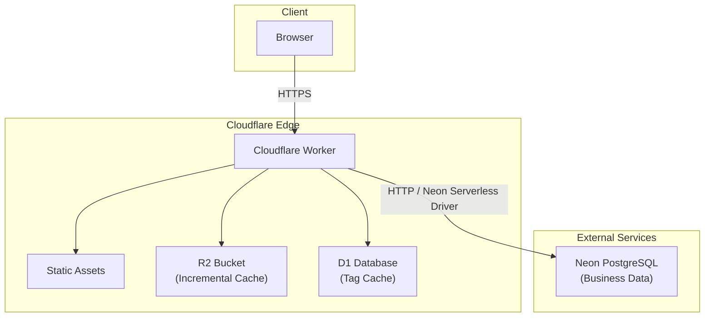
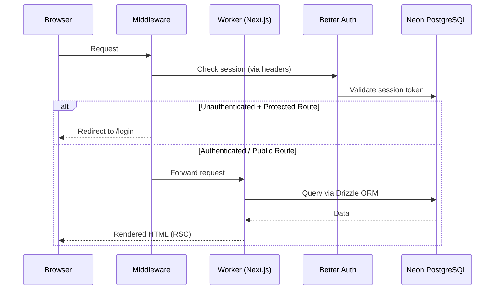

<div align="center"><a name="readme-top"></a>

# Countryside Community Swimming Club

### Complete Digital Solution for Community Swimming Clubs

A comprehensive web-based management system that streamlines operations for community swimming clubs.
Supports membership management, class bookings, instructor scheduling, facility management, payments, and reporting.

[Live Demo][demo-link] · [Issues][github-issues-link]

<br/>

[![][github-license-shield]][github-license-link]
[![][github-forks-shield]][github-forks-link]
[![][github-stars-shield]][github-stars-link]
[![][github-issues-shield]][github-issues-link]

</div>

> **Note**: This project was originally built with Python/Flask/MySQL and has been fully rewritten using a modern stack (Next.js, React, Neon PostgreSQL, Drizzle ORM, Better Auth). It is now deployed on Cloudflare Workers.

---

## Tech Stack

<div align="center">
  <table>
    <tr>
      <td align="center" width="96">
        
        <br>Next.js 16
      </td>
      <td align="center" width="96">
        
        <br>React 19
      </td>
      <td align="center" width="96">
        
        <br>TypeScript 5
      </td>
      <td align="center" width="96">
        
        <br>Tailwind CSS 4
      </td>
      <td align="center" width="96">
        
        <br>Neon PostgreSQL
      </td>
      <td align="center" width="96">
        
        <br>Cloudflare Workers
      </td>
    </tr>
  </table>
</div>

| Layer | Technology |
|-------|-----------|
| **Framework** | Next.js 16 (App Router) |
| **UI** | React 19, Tailwind CSS 4, shadcn/ui (Base Nova), Lucide Icons |
| **Calendar** | FullCalendar 6 |
| **Database** | Neon Serverless PostgreSQL + Drizzle ORM |
| **Authentication** | Better Auth (email/password, session-based) |
| **Deployment** | Cloudflare Workers via @opennextjs/cloudflare |
| **Caching** | Cloudflare R2 (incremental cache) + D1 (tag cache) |
| **Validation** | Zod 4 |

---

## Architecture

### System Overview


```mermaid
graph TB
    subgraph "Client"
        Browser["Browser"]
    end

    subgraph "Cloudflare Edge"
        Worker["Cloudflare Worker"]
        Assets["Static Assets"]
        R2["R2 Bucket<br/>(Incremental Cache)"]
        D1["D1 Database<br/>(Tag Cache)"]
    end

    subgraph "External Services"
        Neon["Neon PostgreSQL<br/>(Business Data)"]
    end

    Browser -->|HTTPS| Worker
    Worker --> Assets
    Worker --> R2
    Worker --> D1
    Worker -->|HTTP / Neon Serverless Driver| Neon
```

### Request Flow


```mermaid
sequenceDiagram
    participant B as Browser
    participant MW as Middleware
    participant W as Worker (Next.js)
    participant BA as Better Auth
    participant DB as Neon PostgreSQL

    B->>MW: Request
    MW->>BA: Check session (via headers)
    BA->>DB: Validate session token

    alt Unauthenticated + Protected Route
        MW-->>B: Redirect to /login
    else Authenticated / Public Route
        MW->>W: Forward request
        W->>DB: Query via Drizzle ORM
        DB-->>W: Data
        W-->>B: Rendered HTML (RSC)
    end
```

### Database Schema

```mermaid
erDiagram
    USER ||--|| MEMBER : has
    USER ||--|| INSTRUCTOR : has
    USER ||--|| MANAGER : has
    INSTRUCTOR ||--o{ CLASS : teaches
    CLASS ||--o{ BOOKING : contains
    MEMBER ||--o{ BOOKING : makes
    CLASS }|--|| CLASS_TYPE : belongs_to
    CLASS }|--|| LOCATION : assigned_to
    BOOKING ||--o| PAYMENT : generates
    PRODUCT ||--o{ PAYMENT : includes
    MANAGER ||--o{ NEWS : creates

    USER {
        text id PK
        text name
        varchar email UK
        boolean email_verified
        timestamp created_at
        enum role "member | instructor | manager"
        boolean is_active
    }

    MEMBER {
        serial id PK
        text user_id FK
        varchar first_name
        varchar last_name
        varchar phone
        varchar email
        enum membership_type "Monthly | Annual | None"
        date expired_date
        text health_info
    }

    INSTRUCTOR {
        serial id PK
        text user_id FK
        varchar title
        varchar first_name
        varchar last_name
        varchar position
        varchar phone
        varchar email
        text profile
    }

    CLASS {
        serial id PK
        integer instructor_id FK
        integer location_id FK
        integer class_type_id FK
        timestamp start_time
        timestamp end_time
        integer open_slot
        enum status "active | cancelled"
    }

    BOOKING {
        serial id PK
        integer member_id FK
        integer class_id FK
        timestamp created_at
        enum status "booked | cancelled"
        boolean is_attended
    }

    PAYMENT {
        serial id PK
        integer product_id FK
        integer booking_id FK
        integer member_id FK
        decimal total
        timestamp paid_at
        boolean is_paid
    }
```

---

## Project Structure

```
countryside-community-swimming-club/
├── app/                          # Next.js App Router
│   ├── (auth)/                   # Auth pages (login, register)
│   ├── (dashboard)/              # Protected dashboard pages
│   │   ├── attendance/           # Attendance tracking
│   │   ├── booking/              # Booking management
│   │   ├── dashboard/            # Main dashboard
│   │   ├── membership/           # Membership management
│   │   ├── news/manage/          # News management (managers)
│   │   ├── profile/              # User profile
│   │   ├── reports/              # Reports (managers)
│   │   ├── schedule/             # Class scheduling
│   │   ├── settings/             # Settings (class-types, locations, pricing)
│   │   └── users/                # User management (members, instructors)
│   ├── (public)/                 # Public pages (home, courses, instructors, news, timetable)
│   └── api/                      # API routes (auth, register, classes/overlap)
├── components/                   # React components (UI + layout)
├── lib/
│   ├── actions/                  # Server Actions (booking, class, membership, news, profile, user, settings)
│   ├── db/
│   │   ├── schema.ts             # Drizzle ORM schema (all tables)
│   │   ├── index.ts              # Neon HTTP database connection
│   │   ├── transaction.ts        # Transaction-capable database connection
│   │   └── queries/              # Database query helpers
│   ├── auth.ts                   # Better Auth configuration
│   ├── auth-client.ts            # Client-side auth
│   └── auth-utils.ts             # Session/role utilities (getSession, requireRole)
├── middleware.ts                  # Auth middleware (route protection)
├── drizzle/                      # Drizzle migrations
├── scripts/                      # Database seed scripts
├── wrangler.jsonc                # Cloudflare Worker config
├── open-next.config.ts           # OpenNext adapter config
├── next.config.ts                # Next.js config
├── drizzle.config.ts             # Drizzle Kit config
└── package.json
```

---

## Key Features

### Multi-Role Access Control

| Role | Capabilities |
|------|-------------|
| **Member** | View/edit profile, book classes, view booking history, manage membership, view timetable |
| **Instructor** | Manage schedule, track attendance, view student profiles |
| **Manager** | Full system access: user management, class scheduling, facility management, reports, news |

### Modules

| Module | Description |
|--------|-------------|
| **Authentication** | Email/password auth with Better Auth, session management (7-day expiry) |
| **Booking** | Class booking/cancellation with real-time slot management (transactional) |
| **Scheduling** | FullCalendar-based timetable with conflict detection |
| **Membership** | Monthly/Annual subscription management |
| **Attendance** | Per-class attendance tracking by instructors |
| **Reporting** | Financial and operational analytics (managers only) |
| **News** | Club announcements managed by managers |
| **Settings** | Class types, pool/lane locations, pricing (managers only) |

---

## Getting Started

### Prerequisites

- Node.js 20+
- npm
- A [Neon](https://neon.tech) PostgreSQL database (free tier available)

### Local Development

```bash
# Clone
git clone https://github.com/ChanMeng666/countryside-community-swimming-club.git
cd countryside-community-swimming-club

# Install dependencies
npm install

# Set up environment variables
cp .env.example .env.local
# Edit .env.local with your database URL and auth secret

# Run database migrations
npx drizzle-kit push

# Seed the database (optional)
npx tsx scripts/seed.ts

# Start dev server
npm run dev
```

Open [http://localhost:3000](http://localhost:3000).

### Environment Variables

| Variable | Description |
|----------|-------------|
| `DATABASE_URL` | Neon PostgreSQL connection string |
| `BETTER_AUTH_SECRET` | Secret key for session signing |
| `BETTER_AUTH_URL` | App URL for auth callbacks |
| `NEXT_PUBLIC_APP_URL` | Public-facing app URL |

---

## Deployment (Cloudflare Workers)

This project is deployed to Cloudflare Workers using [@opennextjs/cloudflare](https://github.com/opennextjs/opennextjs-cloudflare).

### Infrastructure

| Cloudflare Resource | Purpose |
|---------------------|---------|
| **Worker** | Runs the Next.js application |
| **R2 Bucket** | Stores incremental cache (pre-rendered pages) |
| **D1 Database** | Stores cache revalidation tags |

All resources run within Cloudflare's free tier.

### Deploy Commands

```bash
# Build the worker bundle
npm run build:worker

# Preview locally
npm run preview

# Deploy to Cloudflare
npm run deploy
```

### First-Time Setup

```bash
# Login to Cloudflare
npx wrangler login

# Create R2 bucket
npx wrangler r2 bucket create countryside-swimming-club-cache

# Create D1 database
npx wrangler d1 create countryside-swimming-club-tags
# Update the database_id in wrangler.jsonc

# Create revalidations table
npx wrangler d1 execute countryside-swimming-club-tags \
  --command "CREATE TABLE IF NOT EXISTS revalidations (tag TEXT PRIMARY KEY, revalidatedAt INTEGER)" \
  --remote

# Set secrets
npx wrangler secret put DATABASE_URL
npx wrangler secret put BETTER_AUTH_SECRET
```

---

## License

This project is licensed under the Apache-2.0 License - see the [LICENSE](LICENSE) file for details.

## Author

**Chan Meng**

- LinkedIn: [chanmeng666](https://www.linkedin.com/in/chanmeng666/)
- GitHub: [ChanMeng666](https://github.com/ChanMeng666)
- Website: [chanmeng.org](https://chanmeng.org/)

---

<!-- LINK DEFINITIONS -->

[demo-link]: https://countryside-swimming-club.chanmeng-dev.workers.dev
[github-issues-link]: https://github.com/ChanMeng666/countryside-community-swimming-club/issues
[github-stars-link]: https://github.com/ChanMeng666/countryside-community-swimming-club/stargazers
[github-forks-link]: https://github.com/ChanMeng666/countryside-community-swimming-club/forks
[github-release-link]: https://github.com/ChanMeng666/countryside-community-swimming-club/releases

[github-forks-shield]: https://img.shields.io/github/forks/ChanMeng666/countryside-community-swimming-club?color=8ae8ff&labelColor=black&style=flat-square
[github-stars-shield]: https://img.shields.io/github/stars/ChanMeng666/countryside-community-swimming-club?color=ffcb47&labelColor=black&style=flat-square
[github-issues-shield]: https://img.shields.io/github/issues/ChanMeng666/countryside-community-swimming-club?color=ff80eb&labelColor=black&style=flat-square
[github-license-shield]: https://img.shields.io/badge/license-Apache--2.0-white?labelColor=black&style=flat-square
[github-license-link]: https://github.com/ChanMeng666/countryside-community-swimming-club/blob/main/LICENSE
